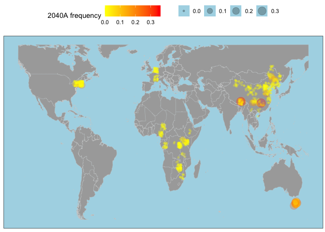
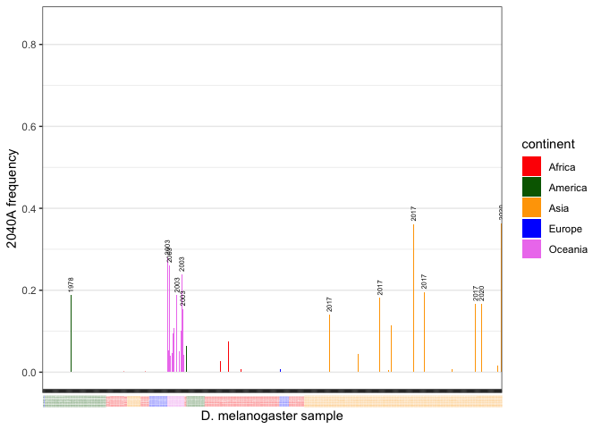
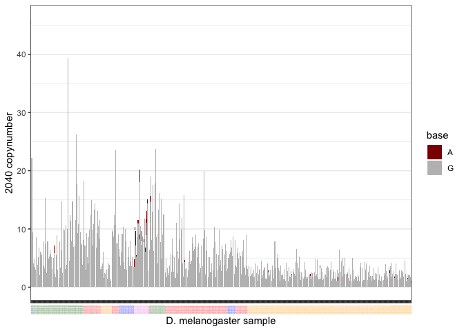
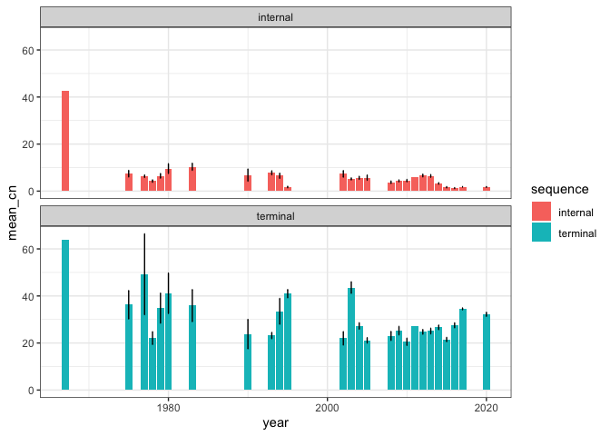

SNP 2040 map
================

``` r
suppressPackageStartupMessages(library(tidyverse))
suppressPackageStartupMessages(library(knitr))
suppressPackageStartupMessages(library(kableExtra))
suppressPackageStartupMessages(library(ggpubr))
suppressPackageStartupMessages(library(svglite))
theme_set(theme_bw())
```

``` r
library(tidyverse)

# Define the directories
folder_dsim <- "/Volumes/Storage/mining/Pele-SNP/Dsim"
folder_dmel <- "/Volumes/Storage/mining/Pele-SNP/Dmel"

# Define the columns
columns <- c("TEfam", "sample_id", "pos", "refbase", "A", "C", "G", "T", "cov", "phys_cov", "hq_cov", "snp", "refsnp", "int_del", "int_del_freq", "trunc_left", "trunc_right", "ins", "delet", "annotation")


# Create an empty tibble with the specified columns
data <- tibble(TEfam = character(),
  sample_id = character(),
  pos = integer(),
  refbase = character(),
  A = double(),
  C = double(),
  G = double(),
  T = double(),
  cov = double(),
  phys_cov = double(),
  hq_cov = double(),
  snp = logical(),
  refsnp = logical(),
  int_del = logical(),
  int_del_freq = numeric(),
  trunc_left = logical(),
  trunc_right = logical(),
  ins = logical(),
  delet = logical(),
  annotation = character()
)

# List all files in the folder_dsim directory
files_dsim <- list.files(folder_dsim, pattern = "\\.PPI251$", full.names = TRUE)
files_dmel <- list.files(folder_dmel, pattern = "\\.PPI251$", full.names = TRUE)
```

    # Read each file, add the species column, and bind the rows
    for (file in files_dsim) {
      sample <- read_table(file, skip = 3, col_names = columns) %>%
        mutate(species = "D. simulans") %>% type_convert() %>% select(-int_del, -int_del_freq)
      data <- bind_rows(data, sample)
    }

    for (file in files_dmel) {
      sample <- read_table(file, skip = 3, col_names = columns) %>%
        mutate(species = "D. melanogaster") %>% type_convert() %>% select(-int_del, -int_del_freq)
      data <- bind_rows(data, sample)
    }

    write_tsv(data, "/Volumes/Storage/mining/Pele-SNP/Pele-data.tsv")

``` r
data <- read_tsv("/Volumes/Storage/Pele-SNP/data/Pele-data.tsv")
```

    ## Warning: One or more parsing issues, call `problems()` on your data frame for details,
    ## e.g.:
    ##   dat <- vroom(...)
    ##   problems(dat)

    ## Rows: 4037823 Columns: 21
    ## ── Column specification ────────────────────────────────────────────────────────
    ## Delimiter: "\t"
    ## chr  (5): TEfam, sample_id, refbase, annotation, species
    ## dbl (10): pos, A, C, G, T, cov, phys_cov, hq_cov, trunc_left, trunc_right
    ## lgl  (6): snp, refsnp, int_del, int_del_freq, ins, delet
    ## 
    ## ℹ Use `spec()` to retrieve the full column specification for this data.
    ## ℹ Specify the column types or set `show_col_types = FALSE` to quiet this message.

``` r
metadata <- read_tsv("/Volumes/Storage/Pele-SNP/data/metadata.tsv")
```

    ## Rows: 879 Columns: 9
    ## ── Column specification ────────────────────────────────────────────────────────
    ## Delimiter: "\t"
    ## chr (6): sample_id, strain, publication, study, study_id, location
    ## dbl (3): year, lat, lon
    ## 
    ## ℹ Use `spec()` to retrieve the full column specification for this data.
    ## ℹ Specify the column types or set `show_col_types = FALSE` to quiet this message.

``` r
full_data <- data %>% mutate(sample_id = gsub(".fastq.sort.bam", "", sample_id)) %>% inner_join(metadata, by="sample_id") %>%
  mutate(period = case_when(year<2000 ~ "<2000", year > 1999 & year < 2010 ~ "2000s", year > 2009 ~ "2010s")) %>%
  mutate(region = case_when(location %in% c("Beijing, China") ~ "Asia", location %in% c("Cameroon", "Gabon", "Ethiopia", "Guinea", "Kenya", "Nigeria", "Rwanda", "South Africa", "Tanzania", "Uganda", "Zambia", "Zimbabwe") ~ "Africa", location %in% c("Canada", "Guadeloupe", "Harwich, MA, USA", "Ithaca, USA", "Providence, USA", "USA") ~ "America", location=="Tasmania, Australia" ~ "Oceania", study_id=="Chen2024" ~ "Asia", TRUE ~ "Europe"))
```

``` r
(snp2040_dmel <- full_data %>% filter(pos==2039, hq_cov>1, study_id!="Kapun2021") %>% mutate(A=A/cov, C=C/cov, G=G/cov, T=T/cov) %>% filter(species=="D. melanogaster"))
```

    ## # A tibble: 840 × 31
    ##    TEfam  sample_id     pos refbase      A       C     G        T   cov phys_cov
    ##    <chr>  <chr>       <dbl> <chr>    <dbl>   <dbl> <dbl>    <dbl> <dbl>    <dbl>
    ##  1 PPI251 SRR097730    2039 G       0      0.00193 0.998 0         9.84        0
    ##  2 PPI251 SRR098323    2039 G       0.0263 0       0.974 0         5.97        0
    ##  3 PPI251 SRR098324    2039 G       0      0       1     0         4.95        0
    ##  4 PPI251 SRR098916    2039 G       0      0       1     0         2.73        0
    ##  5 PPI251 SRR105048    2039 G       0      0       1     0         6.41        0
    ##  6 PPI251 SRR11460801  2039 G       0      0       0.999 0.000765 22.2         0
    ##  7 PPI251 SRR11846560  2039 G       0      0.00104 0.998 0.00104  46.2         0
    ##  8 PPI251 SRR13257684  2039 G       0      0       1     0         9.36        0
    ##  9 PPI251 SRR14293140  2039 G       0      0       1     0         4.02        0
    ## 10 PPI251 SRR14293191  2039 G       0      0       1     0         3.43        0
    ## # ℹ 830 more rows
    ## # ℹ 21 more variables: hq_cov <dbl>, snp <lgl>, refsnp <lgl>, int_del <lgl>,
    ## #   int_del_freq <lgl>, trunc_left <dbl>, trunc_right <dbl>, ins <lgl>,
    ## #   delet <lgl>, annotation <chr>, species <chr>, strain <chr>,
    ## #   publication <chr>, study <chr>, study_id <chr>, year <dbl>, location <chr>,
    ## #   lat <dbl>, lon <dbl>, period <chr>, region <chr>

``` r
world_map <- map_data("world") %>% filter(region != "Antarctica") %>% filter(lat > -55 & lat < 70, long > -135 & long < 160)

(map_world_wrapped <- ggplot() +
    geom_map(data = world_map, map = world_map, aes(long, lat, map_id = region), color = "lightgrey", fill = "darkgrey", linewidth = 0.1) +
    geom_point(data = snp2040_dmel, aes(x = lon, y = lat, color = A, size=A), position = position_jitter(width = 2, height = 2), alpha = 0.25) +
    scale_color_gradient(low="yellow",high="red") +
    theme(plot.title = element_text(hjust = 0.5), axis.text = element_blank(), axis.title = element_blank(), axis.ticks = element_blank(), legend.position = "top", panel.background = element_rect(fill="lightblue"), panel.grid = element_blank(), plot.margin = margin(0.1, 0.1, 0.1, 0.1, "cm")) +
    labs(color="2040A frequency", size=""))
```

    ## Warning in geom_map(data = world_map, map = world_map, aes(long, lat, map_id =
    ## region), : Ignoring unknown aesthetics: x and y

    ## Warning: Removed 2 rows containing missing values or values outside the scale range
    ## (`geom_point()`).

<!-- -->

``` r
ggsave("/Volumes/Storage/Pele-SNP/figs/map2040A.png", map_world_wrapped, dpi=1000)
```

    ## Saving 7 x 5 in image

    ## Warning: Removed 2 rows containing missing values or values outside the scale range
    ## (`geom_point()`).

``` r
pele_year <- full_data %>% filter(pos==2039, hq_cov>1, study_id!="Kapun2021") %>% mutate(A=A/cov, C=C/cov, G=G/cov, T=T/cov) %>% mutate(sample_year = paste0(sample_id, " (", year, ")")) %>% mutate(label_colors = case_when(region=="Africa"~"red", region=="America"~"darkgreen", region=="Europe"~"blue", region=="Oceania"~"violet", region=="Asia"~"orange")) %>% distinct()

sample_order <- pele_year %>% select(sample_year, year) %>% arrange(year) %>% select(sample_year) %>% pull()
pele_year$sample_year <- factor(pele_year$sample_year, levels = sample_order)
labels_order <- pele_year %>% select(sample_year, year, label_colors) %>% arrange(year) %>% select(label_colors) %>% pull()

pele_year %>% select(sample_year) %>% distinct
```

    ## # A tibble: 480 × 1
    ##    sample_year       
    ##    <fct>             
    ##  1 SRR097730 (2002)  
    ##  2 SRR098323 (2005)  
    ##  3 SRR098324 (2005)  
    ##  4 SRR098916 (2004)  
    ##  5 SRR105048 (2004)  
    ##  6 SRR11460801 (1975)
    ##  7 SRR11846560 (1967)
    ##  8 SRR13257684 (1975)
    ##  9 SRR14293140 (1975)
    ## 10 SRR14293191 (1975)
    ## # ℹ 470 more rows

``` r
(barplot <- ggplot(pele_year, aes(x = sample_year, y = A, fill = region)) +
  geom_bar(stat = "identity", position = "dodge") +
  scale_fill_manual(values = c("red","darkgreen","orange","blue","violet")) +
  geom_text(aes(label=year), size=ifelse(pele_year$A>0.125, 2, 0), angle=90, hjust = -0.2) +
  theme(panel.grid.major.x = element_blank(),
        panel.grid.minor.x = element_blank(), axis.text.x.bottom = element_text(size = 1, color = labels_order), axis.text.x = element_text(size = 1, angle = 90)) +
  labs(fill = "continent", x="D. melanogaster sample", y="2040A frequency")+
  ylim(0, 0.85))
```

    ## Warning: Vectorized input to `element_text()` is not officially supported.
    ## ℹ Results may be unexpected or may change in future versions of ggplot2.

<!-- -->

``` r
ggsave("/Volumes/Storage/Pele-SNP/figs/2040A_frequency.png", barplot, dpi=1000)
```

    ## Saving 7 x 5 in image

``` r
cn_pele <- pele_year %>% mutate(A=A*cov, G=G*cov) %>% select(-C, -T) %>% pivot_longer(cols = c(A, G), names_to = "base", values_to = "base_coverage") %>% filter(base_coverage>0) %>% arrange(year)

(barplot_cn <- ggplot(cn_pele, aes(x=sample_year, y=base_coverage, fill=base))+
  geom_bar(stat="identity")+
  theme(panel.grid.major.x = element_blank(), panel.grid.minor.x = element_blank(), axis.text.x.bottom = element_text(size = 1, color = labels_order), axis.text.x = element_text(size = 1, angle = 90)) +
  scale_fill_manual(values = c("darkred","grey")) +
  labs(fill = "base", x="D. melanogaster sample", y="2040 copynumber"))
```

    ## Warning: Vectorized input to `element_text()` is not officially supported.
    ## ℹ Results may be unexpected or may change in future versions of ggplot2.

<!-- -->

``` r
ggsave("/Volumes/Storage/Pele-SNP/figs/2040A_copynumber.png", barplot_cn, dpi=1000)
```

    ## Saving 7 x 5 in image

``` r
(pele_separated <- full_data %>% filter(study!="Kapun2021", year>1966) %>%
   mutate(sequence = case_when(pos<300 | pos>2607 ~ "terminal", pos>999 & pos<2001 ~ "internal", TRUE ~ "intermediate")) %>%
   group_by(sample_id, sequence, year, period, lat, lon, region, location) %>%
   summarise(value = mean(cov)) %>%
   filter(sequence!="intermediate") %>%
   pivot_wider(names_from = sequence) %>%
   mutate(difference = terminal - internal) %>%
   mutate(status = ifelse(internal<1, "no_full_length", "full_length")) %>%
   pivot_longer(cols = c(internal, terminal), names_to = "sequence", values_to = "coverage"))
```

    ## `summarise()` has grouped output by 'sample_id', 'sequence', 'year', 'period',
    ## 'lat', 'lon', 'region'. You can override using the `.groups` argument.

    ## # A tibble: 1,614 × 11
    ## # Groups:   sample_id, year, period, lat, lon, region [807]
    ##    sample_id  year period   lat   lon region location difference status sequence
    ##    <chr>     <dbl> <chr>  <dbl> <dbl> <chr>  <chr>         <dbl> <chr>  <chr>   
    ##  1 SRR097730  2002 2000s     -2    14 Africa Gabon          16.9 full_… internal
    ##  2 SRR097730  2002 2000s     -2    14 Africa Gabon          16.9 full_… terminal
    ##  3 SRR098323  2005 2000s      1    33 Africa Uganda         18.7 full_… internal
    ##  4 SRR098323  2005 2000s      1    33 Africa Uganda         18.7 full_… terminal
    ##  5 SRR098324  2005 2000s      1    33 Africa Uganda         12.3 full_… internal
    ##  6 SRR098324  2005 2000s      1    33 Africa Uganda         12.3 full_… terminal
    ##  7 SRR098915  2004 2000s      6    10 Africa Cameroon       12.2 no_fu… internal
    ##  8 SRR098915  2004 2000s      6    10 Africa Cameroon       12.2 no_fu… terminal
    ##  9 SRR098916  2004 2000s      6    10 Africa Cameroon       19.1 no_fu… internal
    ## 10 SRR098916  2004 2000s      6    10 Africa Cameroon       19.1 no_fu… terminal
    ## # ℹ 1,604 more rows
    ## # ℹ 1 more variable: coverage <dbl>

``` r
pele_separated_year <- pele_separated %>% group_by(year, sequence) %>% summarise(mean_cn = mean(coverage), se = sd(coverage) / sqrt(n()))
```

    ## `summarise()` has grouped output by 'year'. You can override using the
    ## `.groups` argument.

``` r
ggplot(pele_separated_year, aes(x=year, y=mean_cn, fill = sequence))+
  geom_bar(stat="identity")+
  geom_errorbar(aes(ymin = mean_cn - se, ymax = mean_cn + se), width = 0.1, position = position_dodge(0.7)) +
  facet_wrap(~sequence, ncol = 1)
```

<!-- -->
