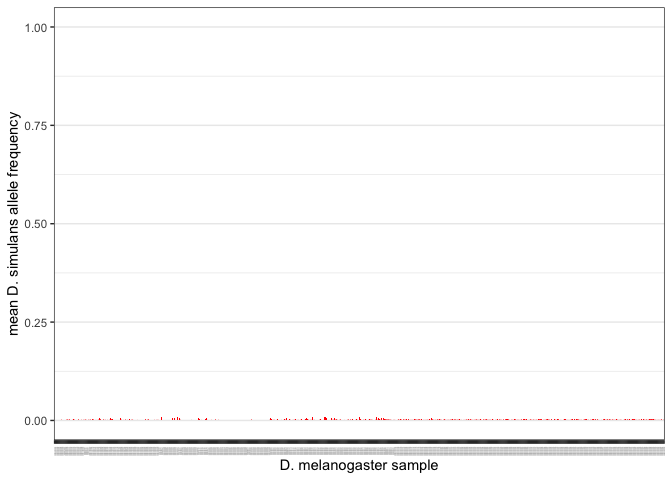
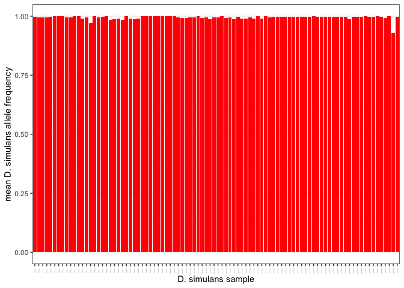

Check D. simulans contamination using single copy genes
================

``` r
suppressPackageStartupMessages(library(tidyverse))
suppressPackageStartupMessages(library(knitr))
suppressPackageStartupMessages(library(kableExtra))
suppressPackageStartupMessages(library(ggpubr))
suppressPackageStartupMessages(library(svglite))
theme_set(theme_bw())
```

``` r
metadata <- read_tsv("/Volumes/Storage/Pele-SNP/data/metadata.tsv")
```

    ## Rows: 880 Columns: 9
    ## ── Column specification ────────────────────────────────────────────────────────
    ## Delimiter: "\t"
    ## chr (6): sample_id, strain, publication, study, study_id, location
    ## dbl (3): year, lat, lon
    ## 
    ## ℹ Use `spec()` to retrieve the full column specification for this data.
    ## ℹ Specify the column types or set `show_col_types = FALSE` to quiet this message.

``` r
(data_dmel <- read_tsv("/Volumes/Storage/Pele-SNP/data/scg-dmel.tsv") %>% mutate(sample_id = gsub(".fastq.sort.bam", "", sample_id)) %>% inner_join(metadata, by="sample_id") %>%
  mutate(region = case_when(location %in% c("Beijing, China") ~ "Asia", location %in% c("Cameroon", "Gabon", "Ethiopia", "Guinea", "Kenya", "Nigeria", "Rwanda", "South Africa", "Tanzania", "Uganda", "Zambia", "Zimbabwe") ~ "Africa", location %in% c("Canada", "Guadeloupe", "Harwich, MA, USA", "Ithaca, USA", "Providence, USA", "USA") ~ "America", location=="Tasmania, Australia" ~ "Oceania", study_id=="Chen2024" ~ "Asia", TRUE ~ "Europe")))
```

    ## Rows: 18061742 Columns: 10
    ## ── Column specification ────────────────────────────────────────────────────────
    ## Delimiter: "\t"
    ## chr (3): TEfam, sample_id, refbase
    ## dbl (7): pos, A, C, G, T, cov, hq_cov
    ## 
    ## ℹ Use `spec()` to retrieve the full column specification for this data.
    ## ℹ Specify the column types or set `show_col_types = FALSE` to quiet this message.

    ## # A tibble: 17,975,938 × 19
    ##    TEfam    sample_id    pos refbase     A     C     G     T   cov hq_cov strain
    ##    <chr>    <chr>      <dbl> <chr>   <dbl> <dbl> <dbl> <dbl> <dbl>  <dbl> <chr> 
    ##  1 Dmel_rhi ERR6474638     0 C        0        0 0     0     0      0     Orego…
    ##  2 Dmel_rhi ERR6474638     1 A        0.43     0 0     0     0.43   0.253 Orego…
    ##  3 Dmel_rhi ERR6474638     2 T        0        0 0     0.455 0.455  0.278 Orego…
    ##  4 Dmel_rhi ERR6474638     3 T        0        0 0     0.481 0.481  0.303 Orego…
    ##  5 Dmel_rhi ERR6474638     4 T        0        0 0     0.481 0.481  0.303 Orego…
    ##  6 Dmel_rhi ERR6474638     5 T        0        0 0     0.481 0.481  0.303 Orego…
    ##  7 Dmel_rhi ERR6474638     6 G        0        0 0.556 0     0.556  0.379 Orego…
    ##  8 Dmel_rhi ERR6474638     7 G        0        0 0.556 0     0.556  0.379 Orego…
    ##  9 Dmel_rhi ERR6474638     8 G        0        0 0.582 0     0.582  0.405 Orego…
    ## 10 Dmel_rhi ERR6474638     9 G        0        0 0.607 0     0.607  0.43  Orego…
    ## # ℹ 17,975,928 more rows
    ## # ℹ 8 more variables: publication <chr>, study <chr>, study_id <chr>,
    ## #   year <dbl>, location <chr>, lat <dbl>, lon <dbl>, region <chr>

``` r
(data_dsim <- read_tsv("/Volumes/Storage/Pele-SNP/data/scg/scg-dsim.tsv") %>% mutate(sample_id = gsub(".fastq.sort.bam", "", sample_id)))
```

    ## Rows: 1973492 Columns: 12
    ## ── Column specification ────────────────────────────────────────────────────────
    ## Delimiter: "\t"
    ## chr (3): TEfam, sample_id, refbase
    ## dbl (7): pos, A, C, G, T, cov, hq_cov
    ## lgl (2): snp, refsnp
    ## 
    ## ℹ Use `spec()` to retrieve the full column specification for this data.
    ## ℹ Specify the column types or set `show_col_types = FALSE` to quiet this message.

    ## # A tibble: 1,973,492 × 12
    ##    TEfam    sample_id   pos refbase     A     C     G     T   cov hq_cov snp  
    ##    <chr>    <chr>     <dbl> <chr>   <dbl> <dbl> <dbl> <dbl> <dbl>  <dbl> <lgl>
    ##  1 Dmel_rhi ERR668305     0 C           0     0 0         0 0      0     FALSE
    ##  2 Dmel_rhi ERR668305     1 A           0     0 0         0 0      0     FALSE
    ##  3 Dmel_rhi ERR668305     2 T           0     0 0         0 0      0     FALSE
    ##  4 Dmel_rhi ERR668305     3 T           0     0 0         0 0      0     FALSE
    ##  5 Dmel_rhi ERR668305     4 T           0     0 0         0 0      0     FALSE
    ##  6 Dmel_rhi ERR668305     5 T           0     0 0         0 0      0     FALSE
    ##  7 Dmel_rhi ERR668305     6 G           0     0 0.592     0 0.592  0.386 FALSE
    ##  8 Dmel_rhi ERR668305     7 G           0     0 0.566     0 0.566  0.36  FALSE
    ##  9 Dmel_rhi ERR668305     8 G           0     0 0.592     0 0.592  0.386 FALSE
    ## 10 Dmel_rhi ERR668305     9 G           0     0 0.566     0 0.566  0.36  FALSE
    ## # ℹ 1,973,482 more rows
    ## # ℹ 1 more variable: refsnp <lgl>

``` r
(diagnostic_dmel <- read_tsv("/Volumes/Storage/Pele-SNP/data/diagnostic-snps-dmel.tsv") %>% mutate(pos = pos-1) %>% mutate(gene_pos = paste0(TEfam, pos)) %>% select(-TEfam, -pos))
```

    ## Rows: 211 Columns: 4
    ## ── Column specification ────────────────────────────────────────────────────────
    ## Delimiter: "\t"
    ## chr (3): TEfam, Dmel_variant, Dsim_variant
    ## dbl (1): pos
    ## 
    ## ℹ Use `spec()` to retrieve the full column specification for this data.
    ## ℹ Specify the column types or set `show_col_types = FALSE` to quiet this message.

    ## # A tibble: 211 × 3
    ##    Dmel_variant Dsim_variant gene_pos    
    ##    <chr>        <chr>        <chr>       
    ##  1 A            T            Dmel_rhi1251
    ##  2 C            A            Dmel_rhi1985
    ##  3 T            A            Dmel_rhi1998
    ##  4 T            A            Dmel_rhi2248
    ##  5 T            C            Dmel_rhi2387
    ##  6 A            G            Dmel_rhi2455
    ##  7 A            C            Dmel_rhi2459
    ##  8 G            T            Dmel_rhi2483
    ##  9 G            A            Dmel_rhi2514
    ## 10 T            C            Dmel_rhi2557
    ## # ℹ 201 more rows

``` r
data_dmel_diag <- data_dmel %>% mutate(gene_pos = paste0(TEfam, pos)) %>% filter(study_id!="Kapun2021") %>% inner_join(diagnostic_dmel, by="gene_pos") %>% mutate(A=A/cov, C=C/cov, G=G/cov, T=T/cov) %>% pivot_longer(cols = c(A, T, C, G), names_to = "base", values_to = "base_cov")

(data_dmel_diag_dsimsnp <- data_dmel_diag %>% filter(base==Dsim_variant) %>% group_by(sample_id, year) %>% dplyr::summarise(mean_sim_cov = mean(base_cov)) %>% arrange(desc(mean_sim_cov)))
```

    ## `summarise()` has grouped output by 'sample_id'. You can override using the
    ## `.groups` argument.

    ## # A tibble: 580 × 3
    ## # Groups:   sample_id [580]
    ##    sample_id    year mean_sim_cov
    ##    <chr>       <dbl>        <dbl>
    ##  1 SRR1769729   1993      0.00993
    ##  2 SRR189387    2008      0.00987
    ##  3 SRR189277    2010      0.00970
    ##  4 SRR189388    2008      0.00961
    ##  5 SRR189261    2009      0.00948
    ##  6 SRR189270    2008      0.00948
    ##  7 SRR900425    1990      0.00948
    ##  8 SRR189421    1994      0.00718
    ##  9 SRR14298028  1978      0.00618
    ## 10 SRR1663609   1993      0.00615
    ## # ℹ 570 more rows

``` r
(contamination_plot_dmel <- ggplot(data_dmel_diag_dsimsnp, aes(x = reorder(sample_id, year), y = mean_sim_cov)) +
  geom_bar(stat = "identity", position = "dodge", fill = "red") +
  theme(panel.grid.major.x = element_blank(),
        panel.grid.minor.x = element_blank(),
        axis.text.x = element_text(size = 1, angle = 90)) +
  labs(x="D. melanogaster sample", y="mean D. simulans allele frequency")+
  ylim(0, 1))
```

    ## Warning: Removed 125 rows containing missing values or values outside the scale range
    ## (`geom_bar()`).

<!-- -->

``` r
ggsave("/Volumes/Storage/Pele-SNP/figs/dmel-contamination.png", contamination_plot_dmel, dpi=1000)
```

    ## Saving 7 x 5 in image

    ## Warning: Removed 125 rows containing missing values or values outside the scale range
    ## (`geom_bar()`).

``` r
data_dsim_diag <- data_dsim %>% mutate(gene_pos = paste0(TEfam, pos)) %>% inner_join(diagnostic_dmel, by="gene_pos") %>% mutate(A=A/cov, C=C/cov, G=G/cov, T=T/cov) %>% pivot_longer(cols = c(A, T, C, G), names_to = "base", values_to = "base_cov")

(data_dsim_diag_dsimsnp <- data_dsim_diag %>% filter(base==Dsim_variant) %>% group_by(sample_id) %>% filter(cov>0) %>% dplyr::summarise(mean_sim_cov = mean(base_cov)) %>% arrange(desc(mean_sim_cov)))
```

    ## # A tibble: 92 × 2
    ##    sample_id   mean_sim_cov
    ##    <chr>              <dbl>
    ##  1 ERR694699           1   
    ##  2 ERR9452541          1   
    ##  3 SRR11456771         1   
    ##  4 SRR11456791         1   
    ##  5 SRR3084252          1   
    ##  6 SRR3585779          1   
    ##  7 ERR9439680          1.00
    ##  8 ERR9452532          1.00
    ##  9 ERR9436064          1.00
    ## 10 SRR3091655          1.00
    ## # ℹ 82 more rows

``` r
(contamination_plot_dsim <- ggplot(data_dsim_diag_dsimsnp, aes(x = sample_id, y = mean_sim_cov)) +
  geom_bar(stat = "identity", position = "dodge", fill = "red") +
  theme(panel.grid.major.x = element_blank(),
        panel.grid.minor.x = element_blank(),
        axis.text.x = element_text(size = 1, angle = 90)) +
  labs(x="D. simulans sample", y="mean D. simulans allele frequency")+
  ylim(0, 1))
```

<!-- -->

``` r
ggsave("/Volumes/Storage/Pele-SNP/figs/dsim-contamination.png", contamination_plot_dsim, dpi=1000)
```

    ## Saving 7 x 5 in image
