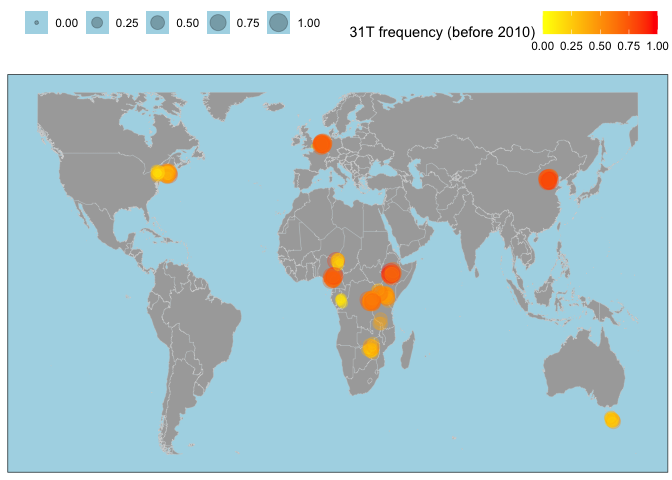
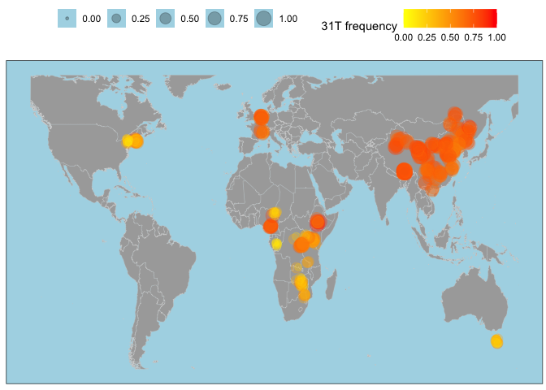

Looking for other SNPs
================

``` r
suppressPackageStartupMessages(library(tidyverse))
suppressPackageStartupMessages(library(knitr))
suppressPackageStartupMessages(library(kableExtra))
suppressPackageStartupMessages(library(ggpubr))
suppressPackageStartupMessages(library(svglite))
theme_set(theme_bw())
```

``` r
library(tidyverse)
```

``` r
data <- read_tsv("/Volumes/Storage/Pele-SNP/data/Pele-data.tsv")
```

    ## Warning: One or more parsing issues, call `problems()` on your data frame for details,
    ## e.g.:
    ##   dat <- vroom(...)
    ##   problems(dat)

    ## Rows: 4037823 Columns: 21
    ## ── Column specification ────────────────────────────────────────────────────────
    ## Delimiter: "\t"
    ## chr  (5): TEfam, sample_id, refbase, annotation, species
    ## dbl (10): pos, A, C, G, T, cov, phys_cov, hq_cov, trunc_left, trunc_right
    ## lgl  (6): snp, refsnp, int_del, int_del_freq, ins, delet
    ## 
    ## ℹ Use `spec()` to retrieve the full column specification for this data.
    ## ℹ Specify the column types or set `show_col_types = FALSE` to quiet this message.

``` r
metadata <- read_tsv("/Volumes/Storage/Pele-SNP/data/metadata.tsv")
```

    ## Rows: 879 Columns: 9
    ## ── Column specification ────────────────────────────────────────────────────────
    ## Delimiter: "\t"
    ## chr (6): sample_id, strain, publication, study, study_id, location
    ## dbl (3): year, lat, lon
    ## 
    ## ℹ Use `spec()` to retrieve the full column specification for this data.
    ## ℹ Specify the column types or set `show_col_types = FALSE` to quiet this message.

``` r
(full_data <- data %>% mutate(sample_id = gsub(".fastq.sort.bam", "", sample_id)) %>% inner_join(metadata, by="sample_id") %>%
  mutate(period = case_when(year<2000 ~ "<2000", year > 1999 & year < 2010 ~ "2000s", year > 2009 ~ "2010s")) %>%
  mutate(region = case_when(location %in% c("Beijing, China") ~ "Asia", location %in% c("Cameroon", "Gabon", "Ethiopia", "Guinea", "Kenya", "Nigeria", "Rwanda", "South Africa", "Tanzania", "Uganda", "Zambia", "Zimbabwe", "Congo") ~ "Africa", location %in% c("Canada", "Guadeloupe", "Harwich, MA, USA", "Ithaca, USA", "Providence, USA", "USA") ~ "America", location=="Tasmania, Australia" ~ "Oceania", study_id=="Chen2024" ~ "Asia", TRUE ~ "Europe")))
```

    ## # A tibble: 3,683,169 × 31
    ##    TEfam  sample_id    pos refbase     A     C     G     T   cov phys_cov hq_cov
    ##    <chr>  <chr>      <dbl> <chr>   <dbl> <dbl> <dbl> <dbl> <dbl>    <dbl>  <dbl>
    ##  1 PPI251 ERR6474638     0 C           0     0     0     0     0        0      0
    ##  2 PPI251 ERR6474638     1 A           0     0     0     0     0        0      0
    ##  3 PPI251 ERR6474638     2 T           0     0     0     0     0        0      0
    ##  4 PPI251 ERR6474638     3 G           0     0     0     0     0        0      0
    ##  5 PPI251 ERR6474638     4 A           0     0     0     0     0        0      0
    ##  6 PPI251 ERR6474638     5 T           0     0     0     0     0        0      0
    ##  7 PPI251 ERR6474638     6 G           0     0     0     0     0        0      0
    ##  8 PPI251 ERR6474638     7 A           0     0     0     0     0        0      0
    ##  9 PPI251 ERR6474638     8 A           0     0     0     0     0        0      0
    ## 10 PPI251 ERR6474638     9 A           0     0     0     0     0        0      0
    ## # ℹ 3,683,159 more rows
    ## # ℹ 20 more variables: snp <lgl>, refsnp <lgl>, int_del <lgl>,
    ## #   int_del_freq <lgl>, trunc_left <dbl>, trunc_right <dbl>, ins <lgl>,
    ## #   delet <lgl>, annotation <chr>, species <chr>, strain <chr>,
    ## #   publication <chr>, study <chr>, study_id <chr>, year <dbl>, location <chr>,
    ## #   lat <dbl>, lon <dbl>, period <chr>, region <chr>

``` r
(dsim_snps <- data %>% filter(species=="D. simulans") %>%
  mutate(sample_id = gsub(".fastq.sort.bam", "", sample_id)) %>%
  group_by(sample_id) %>% mutate(mean_cov = mean(cov)) %>% filter(mean_cov>1) %>%
  pivot_longer(cols = c(A, C, G, T), names_to = "base", values_to = "base_cov") %>%
  select(sample_id, pos, refbase, base, base_cov, cov, hq_cov, species) %>%
  group_by(sample_id, pos) %>% mutate(max_base = max(base_cov)) %>% filter(max_base == base_cov) %>% ungroup() %>%
  filter(refbase!=base, max_base>1) %>%
  group_by(pos) %>% summarise(sample_with_snp = n()) %>% arrange(desc(sample_with_snp)))
```

    ## # A tibble: 13 × 2
    ##      pos sample_with_snp
    ##    <dbl>           <int>
    ##  1  2039              12
    ##  2    10               2
    ##  3    15               2
    ##  4   448               2
    ##  5   481               2
    ##  6   492               2
    ##  7   867               2
    ##  8  1219               2
    ##  9  2000               2
    ## 10  2014               2
    ## 11  2018               2
    ## 12  2043               2
    ## 13  2566               2

``` r
(dmel_snps <- data %>% filter(species=="D. melanogaster") %>%
  mutate(sample_id = gsub(".fastq.sort.bam", "", sample_id)) %>%
  group_by(sample_id) %>% mutate(mean_cov = mean(cov)) %>% filter(mean_cov>1) %>%
  pivot_longer(cols = c(A, C, G, T), names_to = "base", values_to = "base_cov") %>%
  select(sample_id, pos, refbase, base, base_cov, cov, hq_cov, species) %>%
  group_by(sample_id, pos) %>% mutate(max_base = max(base_cov)) %>% filter(max_base == base_cov) %>% ungroup() %>%
  filter(refbase!=base, max_base>1) %>%
  group_by(pos) %>% summarise(sample_with_snp = n()) %>% arrange(desc(sample_with_snp)))
```

    ## # A tibble: 2 × 2
    ##     pos sample_with_snp
    ##   <dbl>           <int>
    ## 1    31             798
    ## 2  2039               8

``` r
(dmel_31 <- full_data %>% filter(pos==31, study_id!="Kapun2021", year<2010) %>% distinct() %>% group_by(sample_id) %>% mutate(mean_cov = mean(cov)) %>% filter(mean_cov>1) %>% mutate(A=A/cov, C=C/cov, G=G/cov, T=T/cov))
```

    ## # A tibble: 262 × 32
    ## # Groups:   sample_id [262]
    ##    TEfam  sample_id     pos refbase     A        C      G       T   cov phys_cov
    ##    <chr>  <chr>       <dbl> <chr>   <dbl>    <dbl>  <dbl>   <dbl> <dbl>    <dbl>
    ##  1 PPI251 SRR097730      31 A       0.764 0        0.0348 2.02e-1  22.1        0
    ##  2 PPI251 SRR098323      31 A       0.618 0        0      3.82e-1  21.4        0
    ##  3 PPI251 SRR098324      31 A       0.444 0        0      5.56e-1  13.5        0
    ##  4 PPI251 SRR098915      31 A       0.419 0        0      5.81e-1  10.7        0
    ##  5 PPI251 SRR098916      31 A       0.438 0        0      5.62e-1  15.7        0
    ##  6 PPI251 SRR105048      31 A       0.322 0        0      6.78e-1  46.8        0
    ##  7 PPI251 SRR11460801    31 A       0.999 0.000929 0      3.55e-4  73.2        0
    ##  8 PPI251 SRR11846560    31 A       0.999 0        0      6.39e-4  75.2        0
    ##  9 PPI251 SRR13257684    31 A       0.825 0        0.0219 1.53e-1  35.3        0
    ## 10 PPI251 SRR14293140    31 A       0.646 0        0.110  2.44e-1  28.7        0
    ## # ℹ 252 more rows
    ## # ℹ 22 more variables: hq_cov <dbl>, snp <lgl>, refsnp <lgl>, int_del <lgl>,
    ## #   int_del_freq <lgl>, trunc_left <dbl>, trunc_right <dbl>, ins <lgl>,
    ## #   delet <lgl>, annotation <chr>, species <chr>, strain <chr>,
    ## #   publication <chr>, study <chr>, study_id <chr>, year <dbl>, location <chr>,
    ## #   lat <dbl>, lon <dbl>, period <chr>, region <chr>, mean_cov <dbl>

``` r
world_map <- map_data("world") %>% filter(region != "Antarctica") %>% filter(lat > -55 & lat < 70, long > -135 & long < 160)

(map_world_wrapped <- ggplot() +
    geom_map(data = world_map, map = world_map, aes(long, lat, map_id = region), color = "lightgrey", fill = "darkgrey", linewidth = 0.1) +
    geom_point(data = dmel_31, aes(x = lon, y = lat, color = T, size = T), position = position_jitter(width = 1, height = 1), alpha = 0.25) +
    scale_color_gradient(low="yellow",high="red") +
    theme(plot.title = element_text(hjust = 0.5), axis.text = element_blank(), axis.title = element_blank(), axis.ticks = element_blank(), legend.position = "top", panel.background = element_rect(fill="lightblue"), panel.grid = element_blank(), plot.margin = margin(0.1, 0.1, 0.1, 0.1, "cm")) +
    labs(color="31T frequency (before 2010)", size=""))
```

    ## Warning in geom_map(data = world_map, map = world_map, aes(long, lat, map_id =
    ## region), : Ignoring unknown aesthetics: x and y

    ## Warning: Removed 1 row containing missing values or values outside the scale range
    ## (`geom_point()`).

<!-- -->

``` r
(dmel_31 <- full_data %>% filter(pos==31, study_id!="Kapun2021") %>% distinct() %>% group_by(sample_id) %>% mutate(mean_cov = mean(cov)) %>% filter(mean_cov>1) %>% mutate(A=A/cov, C=C/cov, G=G/cov, T=T/cov))
```

    ## # A tibble: 547 × 32
    ## # Groups:   sample_id [547]
    ##    TEfam  sample_id     pos refbase     A        C      G       T   cov phys_cov
    ##    <chr>  <chr>       <dbl> <chr>   <dbl>    <dbl>  <dbl>   <dbl> <dbl>    <dbl>
    ##  1 PPI251 SRR097730      31 A       0.764 0        0.0348 2.02e-1  22.1        0
    ##  2 PPI251 SRR098323      31 A       0.618 0        0      3.82e-1  21.4        0
    ##  3 PPI251 SRR098324      31 A       0.444 0        0      5.56e-1  13.5        0
    ##  4 PPI251 SRR098915      31 A       0.419 0        0      5.81e-1  10.7        0
    ##  5 PPI251 SRR098916      31 A       0.438 0        0      5.62e-1  15.7        0
    ##  6 PPI251 SRR105048      31 A       0.322 0        0      6.78e-1  46.8        0
    ##  7 PPI251 SRR11460801    31 A       0.999 0.000929 0      3.55e-4  73.2        0
    ##  8 PPI251 SRR11846560    31 A       0.999 0        0      6.39e-4  75.2        0
    ##  9 PPI251 SRR13257684    31 A       0.825 0        0.0219 1.53e-1  35.3        0
    ## 10 PPI251 SRR14293140    31 A       0.646 0        0.110  2.44e-1  28.7        0
    ## # ℹ 537 more rows
    ## # ℹ 22 more variables: hq_cov <dbl>, snp <lgl>, refsnp <lgl>, int_del <lgl>,
    ## #   int_del_freq <lgl>, trunc_left <dbl>, trunc_right <dbl>, ins <lgl>,
    ## #   delet <lgl>, annotation <chr>, species <chr>, strain <chr>,
    ## #   publication <chr>, study <chr>, study_id <chr>, year <dbl>, location <chr>,
    ## #   lat <dbl>, lon <dbl>, period <chr>, region <chr>, mean_cov <dbl>

``` r
world_map <- map_data("world") %>% filter(region != "Antarctica") %>% filter(lat > -55 & lat < 70, long > -135 & long < 160)

(map_world_wrapped <- ggplot() +
    geom_map(data = world_map, map = world_map, aes(long, lat, map_id = region), color = "lightgrey", fill = "darkgrey", linewidth = 0.1) +
    geom_point(data = dmel_31, aes(x = lon, y = lat, color = T, size = T), position = position_jitter(width = 1, height = 1), alpha = 0.25) +
    scale_color_gradient(low="yellow",high="red") +
    theme(plot.title = element_text(hjust = 0.5), axis.text = element_blank(), axis.title = element_blank(), axis.ticks = element_blank(), legend.position = "top", panel.background = element_rect(fill="lightblue"), panel.grid = element_blank(), plot.margin = margin(0.1, 0.1, 0.1, 0.1, "cm")) +
    labs(color="31T frequency", size=""))
```

    ## Warning in geom_map(data = world_map, map = world_map, aes(long, lat, map_id = region), : Ignoring unknown aesthetics: x and y
    ## Removed 1 row containing missing values or values outside the scale range
    ## (`geom_point()`).

<!-- -->

``` r
ggsave("/Volumes/Storage/Pele-SNP/figs/map31T.png", map_world_wrapped, dpi=1000)
```

    ## Saving 7 x 5 in image

    ## Warning: Removed 1 row containing missing values or values outside the scale range
    ## (`geom_point()`).
