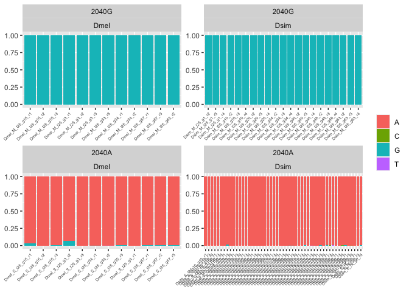

Testing\_2040-SNP
================
Filip Wierzbicki
7/10/2023

``` bash
cd /Volumes/Temp2/filip/2040A/results/snp-p/raw
cat *.PPI251.raw|awk '$3==2039'|awk '{print $2,$5,$6,$7,$8,$9}' > ../forR/2040-snp.forR
```

``` r
library(ggplot2)
library(tidyverse)
```

    ## ── Attaching packages ─────────────────────────────────────── tidyverse 1.3.1 ──

    ## ✔ tibble  3.2.1     ✔ dplyr   1.1.2
    ## ✔ tidyr   1.1.4     ✔ stringr 1.4.0
    ## ✔ readr   2.0.2     ✔ forcats 0.5.1
    ## ✔ purrr   0.3.4

    ## ── Conflicts ────────────────────────────────────────── tidyverse_conflicts() ──
    ## ✖ dplyr::filter() masks stats::filter()
    ## ✖ dplyr::lag()    masks stats::lag()

``` r
t<-read.table("/Volumes/Temp2/filip/2040A/results/snp-p/forR/2040-snp.forR")
names(t)<-c("id","A","C","G","T","cov")
t$id<-gsub(".sort.bam","",t$id)
t$species<-gsub("_.*","",t$id)
t$variant<-gsub("_t.*","",t$id)
t$variant<-gsub(".*_","",t$variant)
t<-subset(t,cov!=0)
t$A<-t$A/t$cov
t$C<-t$C/t$cov
t$G<-t$G/t$cov
t$T<-t$T/t$cov


tx<-t %>% pivot_longer(cols=c('A','C','G','T'),names_to='snp',values_to='freq')

labs <- c("2040G", "2040A")
names(labs) <- c("M","S")

g<-ggplot(tx, aes(x=id, y=freq,fill=snp)) + geom_bar(stat = "identity")+theme(legend.title = element_blank(), axis.title.x=element_blank(),axis.title.y=element_blank(),axis.text.x = element_text(angle=45,vjust = 1,hjust = 1,size=5)) +facet_wrap(variant~species,scales = "free",labeller = labeller(variant=labs))

plot(g)
```

<!-- -->

``` r
ggsave("/Volumes/Temp2/filip/2040A/results/snp-p/figures/2040-snp_test.pdf",width=12,height=6)
ggsave("/Volumes/Temp2/filip/2040A/results/snp-p/figures/2040-snp_test.png",width=12,height=6)
```
