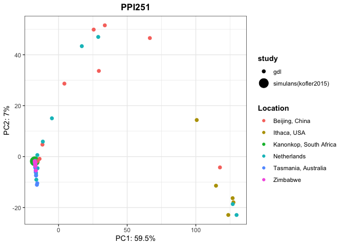

PCA P-element
================

This script is adapted from Riccardos script (Original script:
<https://github.com/Almo96/dmel_TE_invasions/tree/main/PCA-UMAP>, last
accession May 17, 2023)

``` bash
cd /Volumes/Temp2/filip/2040A/PCA
python test.py --min-freq 0 --min-count 0 ppi251 forR
```

``` r
library(tidyverse)
```

    ## ── Attaching packages ─────────────────────────────────────── tidyverse 1.3.1 ──

    ## ✔ ggplot2 3.3.5     ✔ purrr   0.3.4
    ## ✔ tibble  3.1.5     ✔ dplyr   1.0.7
    ## ✔ tidyr   1.1.4     ✔ stringr 1.4.0
    ## ✔ readr   2.0.2     ✔ forcats 0.5.1

    ## ── Conflicts ────────────────────────────────────────── tidyverse_conflicts() ──
    ## ✖ dplyr::filter() masks stats::filter()
    ## ✖ dplyr::lag()    masks stats::lag()

``` r
library(ggpubr)

theme_set(theme_bw())

#full_meta <- read_tsv("/Volumes/Temp3/filip/programs/dmel_TE_invasions/dataset-metadata")
full_meta <- read_tsv("/Volumes/Temp2/filip/2040A/ref/metadata-GDL_1dsim")
```

    ## Rows: 87 Columns: 8

    ## ── Column specification ────────────────────────────────────────────────────────
    ## Delimiter: "\t"
    ## chr (8): run_accession, sample, year, location, lat, long, study, estimated_...

    ## 
    ## ℹ Use `spec()` to retrieve the full column specification for this data.
    ## ℹ Specify the column types or set `show_col_types = FALSE` to quiet this message.

``` r
meta <- full_meta %>% select(run_accession, location, study, estimated_year) %>% rename(ID = "run_accession")

meta %>% group_by(location) %>% summarise(count = n())
```

    ## # A tibble: 6 × 2
    ##   location               count
    ##   <chr>                  <int>
    ## 1 Beijing, China            15
    ## 2 Ithaca, USA               19
    ## 3 Kanonkop, South Africa     1
    ## 4 Netherlands               19
    ## 5 Tasmania, Australia       18
    ## 6 Zimbabwe                  15

``` r
#meta %>% filter(study=="gdl") %>% group_by(location) %>% summarise(count = n())
```

## PCA function

``` r
PCA <- function(af, metadata, titlee){
  
  #full_dataset <- inner_join(metadata, af, by="ID") %>% distinct() %>% type_convert() %>% filter(study=="gdl")
  full_dataset <- inner_join(metadata, af, by="ID") %>% distinct() %>% type_convert() 
  pcaable <- full_dataset %>% select_if(~ !all(. == .[1]))
  pca_result <- prcomp(pcaable[, -c(1:4)], center = TRUE, scale = TRUE)
  var_explained <- pca_result$sdev^2/sum(pca_result$sdev^2)
  
  plot <- ggplot(data.frame(pca_result$x, ID=full_dataset$ID, location=full_dataset$location, year=full_dataset$estimated_year, study=full_dataset$study), aes(x=PC1,y=PC2, color=location)) + geom_point(aes(size = study)) + labs(x=paste0("PC1: ",round(var_explained[1]*100,1),"%"), y=paste0("PC2: ",round(var_explained[2]*100,1),"%"), color="Location") + ggtitle(titlee) + theme(plot.title = element_text(hjust = 0.5, face = "bold"), legend.title = element_text(face = "bold"))
plot
}
```

PPI251

``` r
(PPI251 <- read_tsv("/Volumes/Temp2/filip/2040A/PCA/forR.PCAable"))
```

    ## Rows: 86 Columns: 2876

    ## ── Column specification ────────────────────────────────────────────────────────
    ## Delimiter: "\t"
    ## chr    (1): ID
    ## dbl (2875): PPI251_4, PPI251_5, PPI251_6, PPI251_8, PPI251_9, PPI251_10, PPI...

    ## 
    ## ℹ Use `spec()` to retrieve the full column specification for this data.
    ## ℹ Specify the column types or set `show_col_types = FALSE` to quiet this message.

    ## # A tibble: 86 × 2,876
    ##    ID           PPI251_4 PPI251_5 PPI251_6 PPI251_8 PPI251_9 PPI251_10 PPI251_11
    ##    <chr>           <dbl>    <dbl>    <dbl>    <dbl>    <dbl>     <dbl>     <dbl>
    ##  1 Dsim.cleaned        1     1        1           1        1      1            1
    ##  2 SRR1663528.…        1     1        1           1        1      1            1
    ##  3 SRR1663529.…        1     1        1           1        1      1            1
    ##  4 SRR1663530.…        1     0.99     1           1        1      1            1
    ##  5 SRR1663531.…        1     1        0.99        1        1      1            1
    ##  6 SRR1663532.…        1     1        0.99        1        1      1            1
    ##  7 SRR1663533.…        1     1        1           1        1      1            1
    ##  8 SRR1663534.…        1     1        1           1        1      0.99         1
    ##  9 SRR1663535.…        1     0.99     1           1        1      1            1
    ## 10 SRR1663536.…        1     1        1           1        1      1            1
    ## # … with 76 more rows, and 2,868 more variables: PPI251_12 <dbl>,
    ## #   PPI251_13 <dbl>, PPI251_14 <dbl>, PPI251_15 <dbl>, PPI251_16 <dbl>,
    ## #   PPI251_17 <dbl>, PPI251_18 <dbl>, PPI251_19 <dbl>, PPI251_20 <dbl>,
    ## #   PPI251_21 <dbl>, PPI251_22 <dbl>, PPI251_23 <dbl>, PPI251_24 <dbl>,
    ## #   PPI251_25 <dbl>, PPI251_26 <dbl>, PPI251_27 <dbl>, PPI251_28 <dbl>,
    ## #   PPI251_29 <dbl>, PPI251_30 <dbl>, PPI251_31 <dbl>, PPI251_32 <dbl>,
    ## #   PPI251_33 <dbl>, PPI251_34 <dbl>, PPI251_35 <dbl>, PPI251_36 <dbl>, …

``` r
PPI251$ID <- str_remove(PPI251$ID, "\\.cleaned$")
PCA(PPI251, meta, "PPI251")
```

    ## 
    ## ── Column specification ────────────────────────────────────────────────────────
    ## cols(
    ##   ID = col_character(),
    ##   location = col_character(),
    ##   study = col_character(),
    ##   estimated_year = col_character()
    ## )

    ## Warning: Using size for a discrete variable is not advised.

<!-- -->

``` r
ggsave("/Volumes/Temp2/filip/2040A/PCA/figures/PCA_GDL.pdf",width=9,height=6)
```

    ## Warning: Using size for a discrete variable is not advised.

``` r
ggsave("/Volumes/Temp2/filip/2040A/PCA/figures/PCA_GDL.png",width=9,height=6)
```

    ## Warning: Using size for a discrete variable is not advised.
