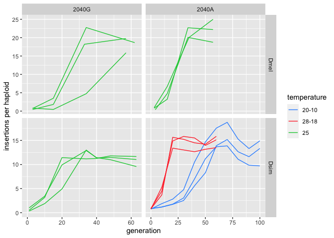

TE\_abundance
================
Filip Wierzbicki
4/11/2023

``` bash
#mapping
##dmel
nohup sh -c 'for i in Dmel_*;do n=${i%.fq.gz};bwa bwasw -t 10 /Volumes/Temp2/filip/2040A/ref/TEs-scg/teseqs-3scg-dmel.fasta $i|samtools sort -@ 4 -m 3G - > /Volumes/Temp2/filip/2040A/map/TEs_3scg/${n}.sort.bam;done' &
##dsim
nohup sh -c 'for i in Dsim_*;do n=${i%.fq.gz};bwa bwasw -t 10 /Volumes/Temp2/filip/2040A/ref/TEs-scg/teseqs-3scg-dsim.fasta $i|samtools sort -@ 4 -m 3G - > /Volumes/Temp2/filip/2040A/map/TEs_3scg/${n}.sort.bam;done' &

#analysis:
cd /Volumes/Temp2/filip/2040A/map/TEs_3scg
for i in *bam;do ln -s /Volumes/Temp2/filip/2040A/map/TEs_3scg/${i} /Volumes/Temp2/filip/2040A/results/deviate/${i};done
cd /Volumes/Temp2/filip/2040A/results/deviate
for i in *bam;do samtools index $i;done
##dmel
nohup sh -c 'for i in Dmel*bam;do cat /Volumes/Temp2/filip/2040A/ref/TEnames.txt|while read TE;do deviaTE_analyse --input $i --single_copy_genes Dmel_tj,Dmel_rpl32,Dmel_rhi --library /Volumes/Temp2/filip/2040A/ref/TEs-scg/teseqs-3scg-dmel.fasta --family $TE;done;done' &
##dsim
nohup sh -c 'for i in Dsim*bam;do cat /Volumes/Temp2/filip/2040A/ref/TEnames.txt|while read TE;do deviaTE_analyse --input $i --single_copy_genes Dsim_tj,Dsim_rpl32,Dsim_rhi --library /Volumes/Temp2/filip/2040A/ref/TEs-scg/teseqs-3scg-dsim.fasta --family $TE;done;done' &
###note that those loops are very time consuming. If this becomes a bottleneck, I can write a storm script that submits multiple commands to parallelize the process
##summary for the P-element:
for i in *PPI251;do awk '$2=="insertions/haploid:"' $i|awk -v a="$i" '{print $3,a}';done|sed 's/.sort.bam.PPI251//g'|awk -F "_" '{print $1,$2,$3,$4,$5}' > forR/PPI241-copynr.forR
```

``` r
library(ggplot2)

t<-read.table("/Volumes/Temp2/filip/2040A/results/deviate/forR/PPI241-copynr.forR")
names(t)<-c("copies","species","variant","temperature","generation","replicate")
t$type<-paste(t$temperature,t$variant,t$species,sep="_")

base<-subset(t,type=="tX_S_Dsim")
baco<-base
baco$temperature<-c("t20-10")
baco$type<-paste(baco$temperature,baco$variant,baco$species,sep="_")

baho<-base
baho$temperature<-c("t28-18")
baho$type<-paste(baho$temperature,baho$variant,baho$species,sep="_")

t<-subset(t,type!="t25_M_Dmel")
t<-subset(t,type!="t25_S_Dmel")
t<-subset(t,type!="tX_S_Dsim")

t<-rbind(baco,baho,t)

t$temperature<-gsub("t","",t$temperature)
t$generation<-as.numeric(gsub("g","",t$generation))

g<-ggplot(t, aes(x=generation, y=copies,color=type,alpha=replicate)) + geom_line()+scale_alpha_discrete(range = c(0.3, 1))
```

    ## Warning: Using alpha for a discrete variable is not advised.

``` r
plot(g)
```

<!-- -->

``` r
#ggsave
```
