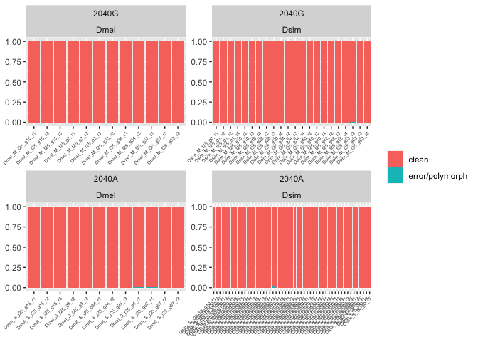

Testing\_SNPs
================
Filip Wierzbicki
4/5/2023

``` bash

#test samples:
##we can make the mpileup file for the 3 genes from the bam file that contains the TEs as well using the -r option but we need to index first all bam files. Luckily, they are already indexed in the deviate folder otherwise you need to do something like this: nohup sh -c 'for i in *bam;do samtools index $i;done' &
#we need the gene names in a file to parse them the the -r option
cd/Volumes/Temp2/filip/2040A/ref/scg-only
cat Dmel_3scg.fasta.fai|awk '{print $1}' > Dmel_3scg-names.txt                                             /Volumes/Temp2/filip/2040A/ref/scg-only
cat Dsim_3scg.fasta.fai|awk '{print $1}' > Dsim_3scg-names.txt

cd /Volumes/Temp2/filip/2040A/results/deviate
##dmel
nohup sh -c 'for i in Dmel*bam;do n=${i%.sort.bam}; cat /Volumes/Temp2/filip/2040A/ref/Dmel_3scg-names.txt|while read gene;do samtools mpileup -q 20 -r ${gene} ${i} -o /Volumes/Temp2/filip/2040A/results/diagnostic_SNPs/testing/mpileup/${n}-${gene}.mpileup;done;done' &
##dsim
nohup sh -c 'for i in Dsim*bam;do n=${i%.sort.bam}; cat /Volumes/Temp2/filip/2040A/ref/Dsim_3scg-names.txt|while read gene;do samtools mpileup -q 20 -r ${gene} ${i} -o /Volumes/Temp2/filip/2040A/results/diagnostic_SNPs/testing/mpileup/${n}-${gene}.mpileup;done;done' &
##combine 
cd /Volumes/Temp2/filip/2040A/results/diagnostic_SNPs/testing/mpileup
mkdir combined
for i in *_rhi.mpileup;do n=${i%_rhi.mpileup};m=${n%-Dsim};m=${m%-Dmel}; cat ${i} ${n}_rpl32.mpileup ${n}_tj.mpileup > combined/${m}.mpileup;done
cd combined
mkdir ../../sync
for i in *.mpileup;do n=${i%.mpileup};java -ea -Xmx7g -jar /Volumes/Temp3/filip/programs/popoolation2_1201/mpileup2sync.jar --input ${i} --output /Volumes/Temp2/filip/2040A/results/diagnostic_SNPs/testing/sync/${n}.sync --fastq-type sanger --min-qual 20 --threads 8;done

###sceener:
cd /Volumes/Temp2/filip/2040A/results/diagnostic_SNPs/testing/sync
for i in Dmel_*;do n=${i%.sync};python /Volumes/Temp2/filip/2040A/programs/2040A_P-element/helper-scripts/contamination-screener.py --sync $i --snp /Volumes/Temp2/filip/2040A/results/diagnostic_SNPs/define/withPop_Dmel-scg.SNPs --min-cov 5 > ../screen/${n}.SNPtest;done

for i in Dsim_*;do n=${i%.sync};python /Volumes/Temp2/filip/2040A/programs/2040A_P-element/helper-scripts/contamination-screener.py --sync $i --snp /Volumes/Temp2/filip/2040A/results/diagnostic_SNPs/define/withPop_Dsim-scg.SNPs --min-cov 5 > ../screen/${n}.SNPtest;done

cd ../screen
for i in *SNPtest;do n=${i%.SNPtest};awk -v a="$n" '{print a,$6}' $i|sort|uniq -c;done > ../forR/summary.forR
```

``` r
library(ggplot2)
t<-read.table("/Volumes/Temp2/filip/2040A/results/diagnostic_SNPs/testing/forR/summary.forR")
names(t)<-c("count","sample","status")

g<-ggplot(t, aes(x=sample, y=count,fill=status)) + geom_bar(stat = "identity")+ylab("number of genes")+xlab("samples")+theme(legend.title = element_blank(), axis.text.x = element_text(angle=45,vjust = 1,hjust = 1,size=5)) #

plot(g)
```

<!-- -->

``` r
ggsave("/Volumes/Temp2/filip/2040A/results/diagnostic_SNPs/figures/SNPtest-count_overview.pdf",width=12,height=6)
```
