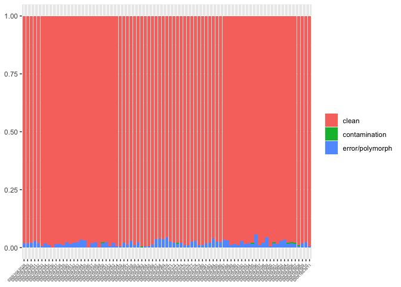
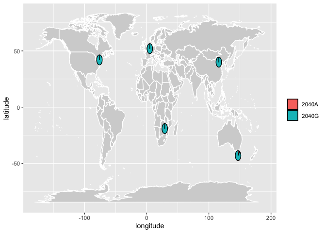

world-wide 2040A-distribution
================
Filip Wierzbicki
4/11/2023

``` bash
cd /Volumes/Temp3/filip/cluster20/data/publavail/gdl_short_reads/renamed
nohup sh -c 'for i in *_1.fq.gz;do n=${i%_1.fq.gz}; gzip -cd ${i} ${n}_2.fq.gz|gzip -c > merged/${n}.fq.gz ;done' & #merging PE data into 1 file
cd merged
nohup sh -c 'for i in *.fq.gz;do n=${i%.fq.gz};bwa bwasw -t 20 /Volumes/Temp2/filip/2040A/ref/TEs-scg/teseqs-3scg-dmel.fasta $i|samtools sort -@ 4 -m 3G - > /Volumes/Temp3/filip/2040A/map/TEs_3scg/gdl/${n}.sort.bam;done' &
cd /Volumes/Temp3/filip/2040A/map/TEs_3scg/gdl/
for i in *bam;do ln -s /Volumes/Temp3/filip/2040A/map/TEs_3scg/gdl/${i} /Volumes/Temp2/filip/2040A/results/gdl/deviate/${i};done
cd /Volumes/Temp2/filip/2040A/results/gdl/deviate
nohup sh -c 'for i in *bam;do samtools index $i;done'&

#diagnostic SNPs testing:
nohup sh -c 'for i in *bam;do n=${i%.sort.bam}; cat /Volumes/Temp2/filip/2040A/ref/Dmel_3scg-names.txt|while read gene;do samtools mpileup -q 20 -r ${gene} ${i} -o /Volumes/Temp2/filip/2040A/results/gdl/diagnostic_SNPs-testing/mpileup/${n}-${gene}.mpileup;done;done' &
##combine 
cd /Volumes/Temp2/filip/2040A/results/gdl/diagnostic_SNPs-testing/mpileup/
mkdir combined
for i in *_rhi.mpileup;do n=${i%_rhi.mpileup};m=${n%-Dsim};m=${m%-Dmel}; cat ${i} ${n}_rpl32.mpileup ${n}_tj.mpileup > combined/${m}.mpileup;done
cd combined
mkdir ../../sync
for i in *.mpileup;do n=${i%.mpileup};java -ea -Xmx7g -jar /Volumes/Temp3/filip/programs/popoolation2_1201/mpileup2sync.jar --input ${i} --output /Volumes/Temp2/filip/2040A/results/gdl/diagnostic_SNPs-testing/sync/${n}.sync --fastq-type sanger --min-qual 20 --threads 8;done
###sceener:
cd ../../sync
mkdir ../screen
for i in *.sync;do n=${i%.sync};python /Volumes/Temp2/filip/2040A/programs/2040A_P-element/helper-scripts/contamination-screener.py --sync $i --snp /Volumes/Temp2/filip/2040A/results/diagnostic_SNPs/define/withPop_Dmel-scg.SNPs --min-cov 5 --min-freq 0.90 > ../screen/${n}.SNPtest;done
cd ../screen
mkdir ../forR
for i in *SNPtest;do n=${i%.SNPtest};awk -v a="$n" '{print a,$6}' $i|sort|uniq -c;done > ../forR/summary.forR


#deviate for PPI251:
conda activate deviaTE_env
nohup sh -c 'for i in *bam;do deviaTE_analyse --input $i --single_copy_genes Dmel_tj,Dmel_rpl32,Dmel_rhi --library /Volumes/Temp2/filip/2040A/ref/TEs-scg/teseqs-3scg-dmel.fasta --family PPI251;done'&
mkdir forR
for i in *.PPI251.raw; do n=${i%.sort.bam.PPI251.raw}; cat $i|awk '$3==2039'|awk -v a="$n" '{print $5,$9,a}';done > forR/2040A.raw ##deviaTE-positions are 0-based!
```

``` r
library(ggplot2)

t<-read.table("/Volumes/Temp2/filip/2040A/results/gdl/diagnostic_SNPs-testing/forR/summary.forR")
names(t)<-c("count","sample","status")

for (sid in unique(t$sample)) { 
  i <- t$sample == sid
  a = sum(t$count[i])
  t$sum[i] = a
}

t$freq<-t$count/t$sum

g<-ggplot(t, aes(x=sample, y=freq,fill=status)) + geom_bar(stat = "identity")+theme(legend.title = element_blank(), axis.text.x = element_text(angle=45,vjust = 1,hjust = 1,size=5),axis.title = element_blank())

plot(g)
```

<!-- -->

``` r
ggsave("/Volumes/Temp2/filip/2040A/results/diagnostic_SNPs/figures/SNPtest_overview-GDL.pdf",width=12,height=6)
ggsave("/Volumes/Temp2/filip/2040A/results/diagnostic_SNPs/figures/SNPtest_overview-GDL.png",width=12,height=6)


#plot 2040 SNP on worldmap:
library(dplyr)
```

    ## 
    ## Attaching package: 'dplyr'

    ## The following objects are masked from 'package:stats':
    ## 
    ##     filter, lag

    ## The following objects are masked from 'package:base':
    ## 
    ##     intersect, setdiff, setequal, union

``` r
library(scatterpie)

t<-read.table("/Volumes/Temp2/filip/2040A/results/gdl/worldmap/ppi251/forR/2040A.raw")
names(t)<-c("count","coverage","sra")
t<-subset(t,sra!="SRR1769729") ##high coverage replicate of ZW155 (not needed)
t<-subset(t,sra!="SRR1663610") ##ZW184 (SRR1663610) reported to be of non-African origin (excluded)

d<-read.table("/Volumes/Temp2/filip/2040A/ref/metadata-GDL.txt",sep="\t")
names(d)<-c("sra","id","year","location","latitude","longitude","study","estimated_year")

td<-left_join(t,d,by="sra")
td$freq<-td$count/td$coverage
td[is.na(td)] <- 0

for (sid in unique(td$location)) { 
  i <- td$location == sid
  a = mean(td$freq[i])
  td$S[i] = a
}
td<-subset(td,select=c("location","latitude","longitude","S"))
td<-unique(td)
td$M<-1-td$S

world_map = map_data("world")
g<-ggplot(world_map, aes(x = long, y = lat, group = group)) +
  geom_polygon(fill="lightgray", colour = "white") +
  geom_scatterpie(aes(longitude, y=latitude), data = td,cols=c("S", "M")) +
  scale_fill_discrete(labels = c("2040A", "2040G"))+xlab("longitude")+ylab("latitude")+
  theme(legend.title=element_blank())

plot(g)
```

    ## Warning: Using the `size` aesthetic in this geom was deprecated in ggplot2 3.4.0.
    ## ℹ Please use `linewidth` in the `default_aes` field and elsewhere instead.
    ## This warning is displayed once every 8 hours.
    ## Call `lifecycle::last_lifecycle_warnings()` to see where this warning was
    ## generated.

<!-- -->

``` r
ggsave("/Volumes/Temp2/filip/2040A/results/figures/SNP_distribution-GDL.pdf",width=9,height=5)
ggsave("/Volumes/Temp2/filip/2040A/results/figures/SNP_distribution-GDL.pdf",width=9,height=5)
```
