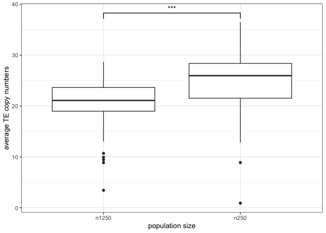

R Notebook
================

``` r
library(ggplot2)
library(ggsignif)
theme_set(theme_bw())
t<-read.table("/Users/rokofler/gh/2040A_P-element/ro/simulations-N/processed")

names(t)<-c( "rep" ,  "gen"   ,  "popstat", "fmale",   "crap1"      ,"fwte",    "avw" ,    "minw" ,   "avtes"   ,   "sampleid")


p <- ggplot(t, aes(y=avtes, x=sampleid))+ geom_boxplot()+ylab("average TE copy numbers")+xlab("population size")+geom_signif(comparisons=list(c("n250","n1250")),map_signif_level=TRUE, test = "wilcox.test")


tr<-wilcox.test(subset(t,sampleid=="n250")$avtes,subset(t,sampleid=="n1250")$avtes)

plot(p)
```

<!-- -->

``` r
print (tr)
```

    ## 
    ##  Wilcoxon rank sum test with continuity correction
    ## 
    ## data:  subset(t, sampleid == "n250")$avtes and subset(t, sampleid == "n1250")$avtes
    ## W = 7390, p-value = 5.267e-09
    ## alternative hypothesis: true location shift is not equal to 0

``` r
ggsave("/Users/rokofler/gh/2040A_P-element/ro/simulations-N/graph.pdf",width=4,height=4)
```
